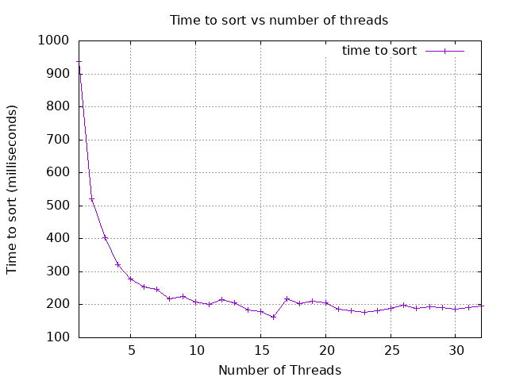

# Project X

- Name: Bowen Moser
- Email: bowenmoser@u.boisestate.edu
- Class: 452-002

## Known Bugs or Issues

No known bugs or issues at this time

## Experience

This was an enjoyable but challening project. Since this is my second time ever writing
a multithreaded program, I referred back to my previous program to help remember how to 
structure the thread creation and joining of my threads back into the main thread. I did use Claude for ideas/help 
and for writing my tests since it has been helpful in the past when I encountered roadblocks.

I did a bit of research into the POSIX thread standard and found barriers. I worked on implementing one to 
try and ensure thread synchronization after all threads had succesfully merged their portion of the array. 
I'm not sure if it was really necessary, but I think it was a nice way of learning another concept and 
applying it to my program. My thought process was if I implement a barrier, I can make sure threads proceed to joining
in an "orderly" fashion with an added layer of control to their behavior, especially since it's hard (or practically impossible)
to verify with just unit tests. 

pthread_barrier doc: https://www.gnu.org/software/gnuastro/manual/html_node/Implementation-of-pthread_005fbarrier.html

## Analysis

My graph doesn't match the example one as threads increase. I've tried a few different things but it sort of stagnates as threads increase, 
rather than increase in time as the number of threads goes up. I think this might be one or more factors. The first is that I'm 
only locking when the main thread merges all other threads together. So it's really just dependent on the main thread merging rather
than each thread sorting and context switching between each one. I've tried to move the mutex lock around but the results have been 
essentially the same, so I'm not sure where else to implement the lock. The other is it may have something to do with my barrier
causing all threads to wait until each one is done? Again, I've tried a few different places to implement the barrier but I think
it makes the most sense where it is currently used. That being said, my results are pretty consistent (running on Onyx) and
the program is fastest between 14 and 16 threads before it begins to stagnate.

