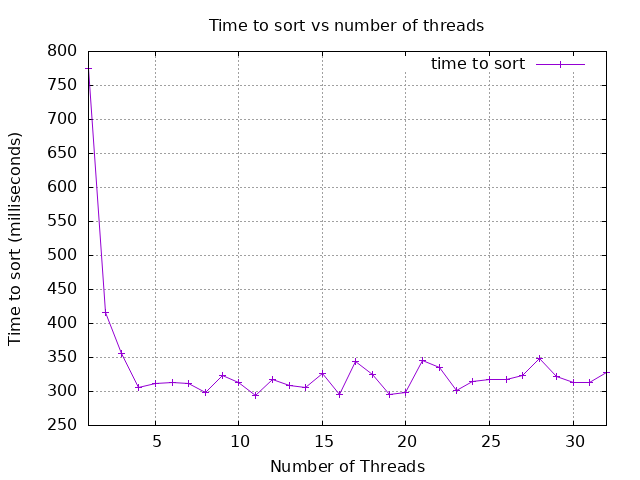

# Submission Report

- Submission generated at 10/26/2025 at 21:49:03

- Machine info: Linux runnervmwhb2z 6.11.0-1018-azure #18~24.04.1-Ubuntu SMP Sat Jun 28 04:46:03 UTC 2025 x86_64 x86_64 x86_64 GNU/Linux

## Note to Students

Please read this report carefully before submission.
Ensure that all sections are complete and accurate.
Look for any errors in the build or test outputs.
If you find any issues, correct them before submitting.
Post any questions on the class discussion board for help.


---

## README

# Project X

- Name: Bowen Moser
- Email: bowenmoser@u.boisestate.edu
- Class: 452-002

## Known Bugs or Issues

No known bugs or issues at this time

## Experience

This was an enjoyable but challening project. Since this is my second time ever writing
a multithreaded program, I referred back to my previous program to help remember how to 
structure the thread creation and joining of my threads back into the main thread. I did use Claude for ideas/help 
and for writing my tests since it has been helpful in the past when I encountered roadblocks.

I did a bit of research into the POSIX thread standard and found barriers. I worked on implementing one to 
try and ensure thread synchronization after all threads had succesfully merged their portion of the array. 
I'm not sure if it was really necessary, but I think it was a nice way of learning another concept and 
applying it to my program. My thought process was if I implement a barrier, I can make sure threads proceed to joining
in an "orderly" fashion with an added layer of control to their behavior, especially since it's hard (or practically impossible)
to verify with just unit tests. 

pthread_barrier doc: https://www.gnu.org/software/gnuastro/manual/html_node/Implementation-of-pthread_005fbarrier.html

## Analysis

My graph doesn't match the example one as threads increase. I've tried a few different things but it sort of stagnates as threads increase, 
rather than increase in time as the number of threads goes up. I think this might be one or more factors. The first is that I'm 
only locking when the main thread merges all other threads together. So it's really just dependent on the main thread merging rather
than each thread sorting and context switching between each one. I've tried to move the mutex lock around but the results have been 
essentially the same, so I'm not sure where else to implement the lock. The other is it may have something to do with my barrier
causing all threads to wait until each one is done? Again, I've tried a few different places to implement the barrier but I think
it makes the most sense where it is currently used. That being said, my results are pretty consistent (running on Onyx) and
the program is fastest between 14 and 16 threads before it begins to stagnate.


---


## Build Output

This section was generated by running `make all` in the project root directory.

```bash
make[1]: Entering directory '/home/runner/work/CS_452_P3_Multithreaded_Application/CS_452_P3_Multithreaded_Application'
mkdir -p build/debug
cc -g -O0 -DDEBUG -fno-omit-frame-pointer -fsanitize=address -c src/lab.c -o build/debug/lab.c.o
mkdir -p build/debug
cc -g -O0 -DDEBUG -fno-omit-frame-pointer -fsanitize=address -c src/main.c -o build/debug/main.c.o
cc -g -O0 -DDEBUG -fno-omit-frame-pointer -fsanitize=address build/debug/lab.c.o build/debug/main.c.o -o build/debug/myapp_d -pthread -fsanitize=address
make[1]: Leaving directory '/home/runner/work/CS_452_P3_Multithreaded_Application/CS_452_P3_Multithreaded_Application'
make[1]: Entering directory '/home/runner/work/CS_452_P3_Multithreaded_Application/CS_452_P3_Multithreaded_Application'
mkdir -p build/release
cc -Wall -Wextra -O2 -fPIE -MMD -MP -Wformat -Wformat=2 -Wconversion -Wsign-conversion -Wimplicit-fallthrough -fstack-protector-strong -Werror=format-security -Werror=implicit -Werror=incompatible-pointer-types -Werror=int-conversion -D_REENTRANT -c src/lab.c -o build/release/lab.c.o
mkdir -p build/release
cc -Wall -Wextra -O2 -fPIE -MMD -MP -Wformat -Wformat=2 -Wconversion -Wsign-conversion -Wimplicit-fallthrough -fstack-protector-strong -Werror=format-security -Werror=implicit -Werror=incompatible-pointer-types -Werror=int-conversion -D_REENTRANT -c src/main.c -o build/release/main.c.o
src/main.c: In function ‘main’:
src/main.c:47:29: warning: conversion from ‘size_t’ {aka ‘long unsigned int’} to ‘unsigned int’ may change value [-Wconversion]
   47 |   mergesort_mt(A, listSize, num_threads);
      |                             ^~~~~~~~~~~
cc -Wall -Wextra -O2 -fPIE -MMD -MP -Wformat -Wformat=2 -Wconversion -Wsign-conversion -Wimplicit-fallthrough -fstack-protector-strong -Werror=format-security -Werror=implicit -Werror=incompatible-pointer-types -Werror=int-conversion -D_REENTRANT build/release/lab.c.o build/release/main.c.o -o build/release/myapp -pthread
make[1]: Leaving directory '/home/runner/work/CS_452_P3_Multithreaded_Application/CS_452_P3_Multithreaded_Application'
make[1]: Entering directory '/home/runner/work/CS_452_P3_Multithreaded_Application/CS_452_P3_Multithreaded_Application'
mkdir -p build/tests
cc -g -O0 -DTEST -fprofile-arcs -ftest-coverage -c src/lab.c -o build/tests/lab.c.o
mkdir -p build/tests
cc -g -O0 -DTEST -fprofile-arcs -ftest-coverage -c src/main.c -o build/tests/main.c.o
mkdir -p build/tests/harness/
cc -g -O0 -DTEST -fprofile-arcs -ftest-coverage -c tests/harness/unity.c -o build/tests/harness/unity.c.o
mkdir -p build/tests/
cc -g -O0 -DTEST -fprofile-arcs -ftest-coverage -c tests/lab-test.c -o build/tests/lab-test.c.o
cc -g -O0 -DTEST -fprofile-arcs -ftest-coverage build/tests/lab.c.o build/tests/main.c.o build/tests/harness/unity.c.o build/tests/lab-test.c.o -o build/tests/myapp_t -pthread -fprofile-arcs -ftest-coverage
make[1]: Leaving directory '/home/runner/work/CS_452_P3_Multithreaded_Application/CS_452_P3_Multithreaded_Application'
make[1]: Entering directory '/home/runner/work/CS_452_P3_Multithreaded_Application/CS_452_P3_Multithreaded_Application'
mkdir -p build/debug-test
cc -g -O0 -DDEBUG -DTEST -fno-omit-frame-pointer -fsanitize=address -c src/lab.c -o build/debug-test/lab.c.o
mkdir -p build/debug-test
cc -g -O0 -DDEBUG -DTEST -fno-omit-frame-pointer -fsanitize=address -c src/main.c -o build/debug-test/main.c.o
mkdir -p build/debug-test/harness/
cc -g -O0 -DDEBUG -DTEST -fno-omit-frame-pointer -fsanitize=address -c tests/harness/unity.c -o build/debug-test/harness/unity.c.o
mkdir -p build/debug-test/
cc -g -O0 -DDEBUG -DTEST -fno-omit-frame-pointer -fsanitize=address -c tests/lab-test.c -o build/debug-test/lab-test.c.o
cc -g -O0 -DDEBUG -DTEST -fno-omit-frame-pointer -fsanitize=address build/debug-test/lab.c.o build/debug-test/main.c.o build/debug-test/harness/unity.c.o build/debug-test/lab-test.c.o -o build/debug-test/myapp_td -pthread -fsanitize=address
make[1]: Leaving directory '/home/runner/work/CS_452_P3_Multithreaded_Application/CS_452_P3_Multithreaded_Application'
Builds completed. You can run the application with: ./build/release/myapp
You can run the debug build with: ./build/debug/myapp_d
You can run the test build with: ./build/tests/myapp_t
You can run the debug-test build with: ./build/debug-test/myapp_td
```

---

## Coverage Report

This section was generated by running `make report` in the project root directory.

```bash
Setting up test...
Tearing down test...
tests/lab-test.c:100:test_basic_sort:PASS
Setting up test...
Tearing down test...
tests/lab-test.c:101:test_sorted_array:PASS
Setting up test...
Tearing down test...
tests/lab-test.c:102:test_reverse_sorted_array:PASS
Setting up test...
Tearing down test...
tests/lab-test.c:103:test_array_with_duplicates:PASS
Setting up test...
Tearing down test...
tests/lab-test.c:104:test_single_element:PASS
Setting up test...
Tearing down test...
tests/lab-test.c:105:test_different_thread_counts:PASS

-----------------------
6 Tests 0 Failures 0 Ignored 
OK
./build/tests/myapp_t
Setting up test...
Tearing down test...
tests/lab-test.c:100:test_basic_sort:PASS
Setting up test...
Tearing down test...
tests/lab-test.c:101:test_sorted_array:PASS
Setting up test...
Tearing down test...
tests/lab-test.c:102:test_reverse_sorted_array:PASS
Setting up test...
Tearing down test...
tests/lab-test.c:103:test_array_with_duplicates:PASS
Setting up test...
Tearing down test...
tests/lab-test.c:104:test_single_element:PASS
Setting up test...
Tearing down test...
tests/lab-test.c:105:test_different_thread_counts:PASS

-----------------------
6 Tests 0 Failures 0 Ignored 
OK
mkdir -p ./build/report/html
mkdir -p ./build/report/txt
gcovr -r . --html --html-details --exclude-directories build/tests/harness --exclude '.*main\.c$' --exclude '.*test\.c$' -o ./build/report/html/coverage_report.html
(INFO) Reading coverage data...

(INFO) Writing coverage report...

gcovr -r . --txt                 --exclude-directories build/tests/harness --exclude '.*main\.c$' --exclude '.*test\.c$'
(INFO) Reading coverage data...

(INFO) Writing coverage report...

------------------------------------------------------------------------------
                           GCC Code Coverage Report
Directory: .
------------------------------------------------------------------------------
File                                       Lines    Exec  Cover   Missing
------------------------------------------------------------------------------
src/lab.c                                    110      93    84%   176,187-188,195-196,219,221-222,224-225,227-228,237,259,269,271-272
------------------------------------------------------------------------------
TOTAL                                        110      93    84%
------------------------------------------------------------------------------
```

---

## Address Sanitizer Report

This section was generated by running `make leak-test` in the project root directory.

```bash
Setting up test...
Tearing down test...
tests/lab-test.c:100:test_basic_sort:PASS
Setting up test...
Tearing down test...
tests/lab-test.c:101:test_sorted_array:PASS
Setting up test...
Tearing down test...
tests/lab-test.c:102:test_reverse_sorted_array:PASS
Setting up test...
Tearing down test...
tests/lab-test.c:103:test_array_with_duplicates:PASS
Setting up test...
Tearing down test...
tests/lab-test.c:104:test_single_element:PASS
Setting up test...
Tearing down test...
tests/lab-test.c:105:test_different_thread_counts:PASS

-----------------------
6 Tests 0 Failures 0 Ignored 
OK
```

---

## Src Files
### lab.c

```c


#define _GNU_SOURCE
#include <stdlib.h>
#include <stdio.h>
#include <sys/time.h> /* for gettimeofday system call */
#include <string.h>
#include <pthread.h>
#include "lab.h"

// Global mutex for synchronizing merge operations
static pthread_mutex_t merge_mutex = PTHREAD_MUTEX_INITIALIZER;
static pthread_barrier_t sort_barrier;

/**
 * @brief Standard insertion sort that is faster than merge sort for small array's
 *
 * @param A The array to sort
 * @param p The starting index
 * @param r The ending index
 */
static void insertion_sort(int A[], int p, int r)
{
  int j;

  for (j = p + 1; j <= r; j++)
    {
      int key = A[j];
      int i = j - 1;
      while ((i > p - 1) && (A[i] > key))
        {
	  A[i + 1] = A[i];
	  i--;
        }
      A[i + 1] = key;
    }
}

/**
 * @brief Sorts an array of ints into ascending order using the constant
 * INSERTION_SORT_THRESHOLD internally
 *
 * @param A A pointer to the start of the array
 * @param p The starting index
 * @param r The ending index
 */
void mergesort_s(int A[], int p, int r)
{
  if (r - p + 1 <=  INSERTION_SORT_THRESHOLD)
    {
      insertion_sort(A, p, r);
    }
  else
    {
      int q = (p + r) / 2;
      mergesort_s(A, p, q);
      mergesort_s(A, q + 1, r);
      merge_s(A, p, q, r);
    }

}

/**
 * @brief Merge two sorted sequences A[p..q] and A[q+1..r] and place merged
 *              output back in array A. Uses extra space proportional to
 *              A[p..r].
 *
 * @param A The array to merge into
 * @param p The starting index of the first half
 * @param q The middle
 * @param r The ending index of the second half
 */
void merge_s(int A[], int p, int q, int r)
{
  // converting to size_t to fix warnings
  size_t size = (size_t)(r - p + 1); 
  int *B = (int *)malloc(sizeof(int) * size);

  int i = p;
  int j = q + 1;
  int k = 0;
  int l;

  /* as long as both lists have unexamined elements */
  /*  this loop keeps executing. */
  while ((i <= q) && (j <= r))
    {
      if (A[i] < A[j])
        {
	  B[k] = A[i];
	  i++;
        }
      else
        {
	  B[k] = A[j];
	  j++;
        }
      k++;
    }

  /* now only at most one list has unprocessed elements. */
  if (i <= q)
    {
      /* copy remaining elements from the first list */
      for (l = i; l <= q; l++)
        {
	  B[k] = A[l];
	  k++;
        }
    }
  else
    {
      /* copy remaining elements from the second list */
      for (l = j; l <= r; l++)
        {
	  B[k] = A[l];
	  k++;
        }
    }

  /* copy merged output from array B back to array A */
  k = 0;
  for (l = p; l <= r; l++)
    {
      A[l] = B[k];
      k++;
    }

  free(B);
}

/**
 * @brief The function that is called by each thread to sort their chunk
 *
 * @param args see struct parallel_args
 * @return void* always NULL
 * AI Use: Assisted by Claude
 */
void *parallel_mergesort(void *args)
{
    struct parallel_args *pargs = (struct parallel_args *)args;
    size_t start = pargs->start;
    size_t end = pargs->end;
    
    if (start < end) {
        mergesort_s(pargs->A, (int)start, (int)end);
    }
    
    //Using barrier to sync threads after each sort, threads wait here until all have sorted their array portion before proceeding
    pthread_barrier_wait(&sort_barrier);
    
    return NULL;
}

/**
 * @brief Sorts an array of ints into ascending order using multiple
 * threads
 *
 * @param A A pointer to the start of the array
 * @param n The size of the array
 * @param num_threads The number of threads to use.
 * AI Use: Assisted by Claude
 */
void mergesort_mt(int *A, size_t n, unsigned int num_threads)
{
    int barrier_initialized = 0;
    int ret = 0;

    // Handling egde case where array size < num threads
    if (n < num_threads) {
        // If array is smaller than thread count, use only as many threads as elements
        num_threads = (unsigned int)n;
    }
    
    if (num_threads > MAX_THREADS) {
        // forcing to max threads if necessary
        num_threads = MAX_THREADS;
    }
    
    if (num_threads <= 1 || n <= INSERTION_SORT_THRESHOLD) {
        mergesort_s(A, 0, (int)(n - 1));
        return;
    }
    
    // Initializing a barrier for my threads 
    ret = pthread_barrier_init(&sort_barrier, NULL, num_threads);
    if (ret != 0) {
        fprintf(stderr, "Failed to initialize barrier: %s\n", strerror(ret));
        return;
    }
    barrier_initialized = 1;

    // Create thread arguments array
    struct parallel_args *thread_args = malloc(sizeof(struct parallel_args) * num_threads);
    if (thread_args == NULL) {
        fprintf(stderr, "Memory allocation failed for thread arguments\n");
        return;
    }

    // Calculate chunk size for each thread
    // Using second approach style from class with added remainder handling
    size_t chunk_size = n / num_threads;
    size_t remainder = n % num_threads;
    size_t current_pos = 0;

    // Create threads and assign work
    size_t threads_created = 0;
    for (size_t i = 0; i < num_threads; i++) {
        thread_args[i].A = A;
        thread_args[i].start = current_pos;
        thread_args[i].end = current_pos + chunk_size - 1;
        
        // Add remainder elements to last thread
        if (i == num_threads - 1) {
            thread_args[i].end += remainder;
        }
        
        ret = pthread_create(&thread_args[i].tid, NULL, parallel_mergesort, &thread_args[i]);
        if (ret != 0) {
            fprintf(stderr, "Failed to create thread %zu: %s\n", i, strerror(ret));
            // Clean up already created threads
            for (size_t j = 0; j < threads_created; j++) {
                pthread_join(thread_args[j].tid, NULL);
            }
            if (barrier_initialized) {
                pthread_barrier_destroy(&sort_barrier);
            }
            free(thread_args);
            return;
        }
        threads_created++;
        current_pos += chunk_size;
    }

    for (unsigned int i = 0; i < num_threads; i++) {
        ret = pthread_join(thread_args[i].tid, NULL);
        if (ret != 0) {
            fprintf(stderr, "Failed to join thread %d: %s\n", i, strerror(ret));
        }
    }
    
    // locking for main thread safety
    pthread_mutex_lock(&merge_mutex);

        // Merge sorted chunks
        // This is a very critical section!
    for (size_t size = chunk_size; size < n; size = size * 2) {
        for (size_t i = 0; i < n - size; i += size * 2) {
            int mid = (int)(i + size - 1);
            int right_end = (int)((i + size * 2 - 1) < (n - 1) ? (i + size * 2 - 1) : (n - 1));
            merge_s(A, (int)i, mid, right_end);
        }
    }
    pthread_mutex_unlock(&merge_mutex);

    // Check for barrier
    if (barrier_initialized) {
        ret = pthread_barrier_destroy(&sort_barrier);
        if (ret != 0) {
            fprintf(stderr, "Failed to destroy barrier: %s\n", strerror(ret));
        }
    }
    free(thread_args);
}

/**
 * @brief retuns the current time as milliseconds
 * @return the number of milliseconds
 */
double getMilliSeconds() {
    struct timeval now;
    gettimeofday(&now, (struct timezone *)0);
    return (double)now.tv_sec * 1000.0 + (double)now.tv_usec / 1000.0;
}

```

### lab.h

```c

#ifndef LAB_H
#define LAB_H

// Threading support
#ifndef _REENTRANT
#define _REENTRANT
#endif
#include <pthread.h>

// Test mode specific configurations
#ifdef TEST
#define ENABLE_VERIFICATION
#endif


  // The threshold that we will use to switch to insertion sort, make sure that
  // you use test arrays bigger than 5 so you are testing the merge sort
#define INSERTION_SORT_THRESHOLD 2
#define MAX_THREADS 32
  /**
   * @brief Sorts an array of ints into ascending order using the constant
   * INSERTION_SORT_THRESHOLD internally
   *
   * @param A A pointer to the start of the array
   * @param p The starting index
   * @param r The ending index
   */
  void mergesort_s(int *A, int p, int r);

  /**
   * @brief Merge two sorted sequences A[p..q] and A[q+1..r] and place merged
   *              output back in array A. Uses extra space proportional to
   *              A[p..r].
   *
   * @param A The array to merge into
   * @param p The starting index of the first half
   * @param q The middle
   * @param r The ending index of the second half
   */
  void merge_s(int A[], int p, int q, int r);

  /**
   * @brief Sorts an array of ints into ascending order using multiple
   * threads
   *
   * @param A A pointer to the start of the array
   * @param n The size of the array
   * @param num_threads The number of threads to use.
   */
  void mergesort_mt(int *A, size_t n, unsigned int num_threads);

  /**
   * @brief retuns the current time as milliseconds
   * @return the number of milliseconds
   */
  double getMilliSeconds();

  /**
   * @brief Represents a chunk of the array to be sorted by a thread
   *
   */
  struct parallel_args
  {
    int *A;
    size_t start;
    size_t end;
    pthread_t tid;
  };

  /**
   * @brief The function that is called by each thread to sort their chunk
   *
   * @param args see struct parallel_args
   * @return void* always NULL
   */
  void *parallel_mergesort(void *args);

  /**
   * @brief Entry point for the main function
   *
   * @param argc The argument count
   * @param argv The argument array
   * @return The exit code
   */
  int myMain(int argc, char **argv);

#ifdef __cplusplus

#endif

#endif

```

### main.c

```c

#include <stdio.h>
#include <stdlib.h>
#include "lab.h"

#ifndef TEST
/**
 * @brief Main function to test the mergesort_mt function with command line arguments
 * @param argc The number of command line arguments
 * @param argv The array of command line arguments
 * @return 0 on success, 1 on failure
 * AI Use: None
 */
int main(int argc, char **argv)
{

  if (argc < 3)
    {
      printf("usage: %s <array_size> <num_threads>", argv[0]);
      return 1;
    }
  // parsing command line args
  int temp_size = atoi(argv[1]);
  if (temp_size <= 0) {
      fprintf(stderr, "Array size must be positive!\n");
      return 1;
  }
  size_t listSize = (size_t)temp_size;
  
  int temp_threads = atoi(argv[2]);
  if (temp_threads <= 0) {
      fprintf(stderr, "Num threads must be positive!\n");
      return 1;
  }
  size_t num_threads = (size_t)temp_threads;
  int *A = (int *)malloc(sizeof(int) * listSize);
  if (A == NULL)
    {
      fprintf(stderr, "Memory allocation failed!\n");
      return 1;
    }
  for (size_t i = 0; i < listSize; i++)
    {
      A[i] = rand() % 1000; // rand nums up to 1000
    }

  double start = getMilliSeconds();
  mergesort_mt(A, listSize, num_threads);
  double end = getMilliSeconds();
  // printing sorted array for verification
  // for (size_t i = 0; i < listSize; i++)
  //   {
  //     printf("%d ", A[i]);
  //   }
  // printf("\n");
  free(A);

  printf("%zu %f\n", num_threads, end - start);

  return 0;
}
#endif
```

## Tests Files
### lab-test.c

```c

#include <stdlib.h>
#include <stdio.h>
#include "harness/unity.h"
#include "../src/lab.h"
#include <string.h>

// Helper function to verify array is sorted
static int is_sorted(int arr[], int size) {
    for (int i = 1; i < size; i++) {
        if (arr[i] < arr[i-1]) return 0;
    }
    return 1;
}

void setUp(void) {
    printf("Setting up test...\n");
}

void tearDown(void) {
    printf("Tearing down test...\n");
}

// Test basic array sorting
void test_basic_sort(void) {
    int arr[] = {64, 34, 25, 12, 22, 11, 90};
    int size = sizeof(arr) / sizeof(arr[0]);
    mergesort_mt(arr, size, 2);
    TEST_ASSERT_TRUE_MESSAGE(is_sorted(arr, size), "Array should be sorted in ascending order");
    TEST_ASSERT_EQUAL_INT(11, arr[0]);
    TEST_ASSERT_EQUAL_INT(90, arr[size-1]);
}

// Test already sorted array
void test_sorted_array(void) {
    int arr[] = {1, 2, 3, 4, 5, 6, 7, 8};
    int size = sizeof(arr) / sizeof(arr[0]);
    mergesort_mt(arr, size, 2);
    TEST_ASSERT_TRUE_MESSAGE(is_sorted(arr, size), "Array should remain sorted");
    TEST_ASSERT_EQUAL_INT(1, arr[0]);
    TEST_ASSERT_EQUAL_INT(8, arr[size-1]);
}

// Test reverse sorted array
void test_reverse_sorted_array(void) {
    int arr[] = {8, 7, 6, 5, 4, 3, 2, 1};
    int size = sizeof(arr) / sizeof(arr[0]);
    mergesort_mt(arr, size, 2);
    TEST_ASSERT_TRUE_MESSAGE(is_sorted(arr, size), "Reverse sorted array should be sorted ascending");
    TEST_ASSERT_EQUAL_INT(1, arr[0]);
    TEST_ASSERT_EQUAL_INT(8, arr[size-1]);
}

// Test array with duplicates
void test_array_with_duplicates(void) {
    int arr[] = {3, 1, 4, 1, 5, 9, 2, 6, 5, 3, 5};
    int size = sizeof(arr) / sizeof(arr[0]);
    mergesort_mt(arr, size, 3);
    TEST_ASSERT_TRUE_MESSAGE(is_sorted(arr, size), "Array with duplicates should be sorted");
}

// Test single element array
void test_single_element(void) {
    int arr[] = {42};
    int size = 1;
    mergesort_mt(arr, size, 2);
    TEST_ASSERT_EQUAL_INT(42, arr[0]);
}

//different thread counts
void test_different_thread_counts(void) {
    int arr[] = {9, 8, 7, 6, 5, 4, 3, 2, 1};
    int size = sizeof(arr) / sizeof(arr[0]);
    
    // 1 thread
    int arr1[size];
    memcpy(arr1, arr, sizeof(arr));
    mergesort_mt(arr1, size, 1);
    TEST_ASSERT_TRUE_MESSAGE(is_sorted(arr1, size), "Array should be sorted with 1 thread");
    
    // 4 threads
    int arr4[size];
    memcpy(arr4, arr, sizeof(arr));
    mergesort_mt(arr4, size, 4);
    TEST_ASSERT_TRUE_MESSAGE(is_sorted(arr4, size), "Array should be sorted with 4 threads");
    
    // max threads
    int arrMax[size];
    memcpy(arrMax, arr, sizeof(arr));
    mergesort_mt(arrMax, size, MAX_THREADS);
    TEST_ASSERT_TRUE_MESSAGE(is_sorted(arrMax, size), "Array should be sorted with MAX_THREADS");
    
    for (int i = 0; i < size; i++) {
        TEST_ASSERT_EQUAL_INT(arr1[i], arr4[i]);
        TEST_ASSERT_EQUAL_INT(arr1[i], arrMax[i]);
    }
}

int main(void) {
    UNITY_BEGIN();
    RUN_TEST(test_basic_sort);
    RUN_TEST(test_sorted_array);
    RUN_TEST(test_reverse_sorted_array);
    RUN_TEST(test_array_with_duplicates);
    RUN_TEST(test_single_element);
    RUN_TEST(test_different_thread_counts);
    return UNITY_END();
}

```

## Scripts Files
### createplot.sh

```c

#!/usr/bin/env bash
#NOTE!!! THIS needs to be in the scripts directory!!!
function usage() {
    echo "$0 usage:" && grep " .)\ #" $0
    exit 0
}
[ $# -eq 0 ] && usage
while getopts "hs:f:" arg; do
    case $arg in
    s) # The size of the array to sort.
        size=${OPTARG}
        ;;
    f) # The plot file name
        name=${OPTARG}
        ;;
    h | *) # Display help.
        usage
        exit 0
        ;;
    esac
done
MYAPP="../build/release/myapp"

if [ "$name" == "" ] || [ "$size" == "" ]
then
        usage
        exit 0
fi
if [ -e $MYAPP ]; then
    if [ -e "data.dat" ]; then
        rm -f data.dat
    fi
    echo "Running myprogram to generate data"
    echo "#Time Threads" >> data.dat
    for n in {1..32}; do
        echo -ne "running $n thread \r"
        $MYAPP "$size" "$n" >> data.dat
    done
    gnuplot -e "filename='$name.png'" graph.plt
    echo "Created plot $name.png from data.dat file"
else
    echo "myapp is not present in the build directory. Did you compile your code?"
fi
```

Report generated on 10/26/2025 at 21:49:05


---

## End of Report

SHA-256 Hash of the report: 2eb058b1d981e7b6ea26f429faa32937f68f5bb2e13e4b2ae66f255bb409a397

Do not edit the generated report. Any changes will be reported as academic dishonesty

---
## GitHub Info
- GitHub repo name: bmoserEDU/CS_452_P3_Multithreaded_Application
- The repository visibility is public.
- The workflow was triggered by bmoserEDU
